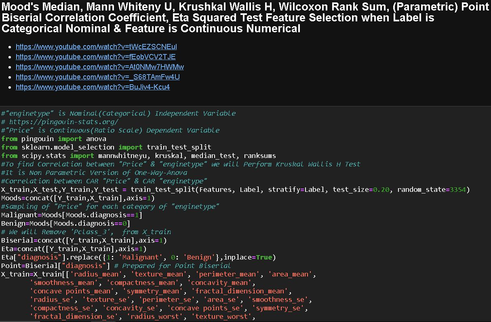
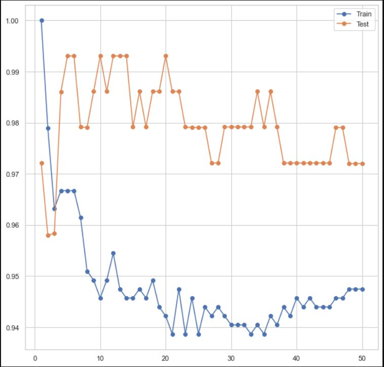
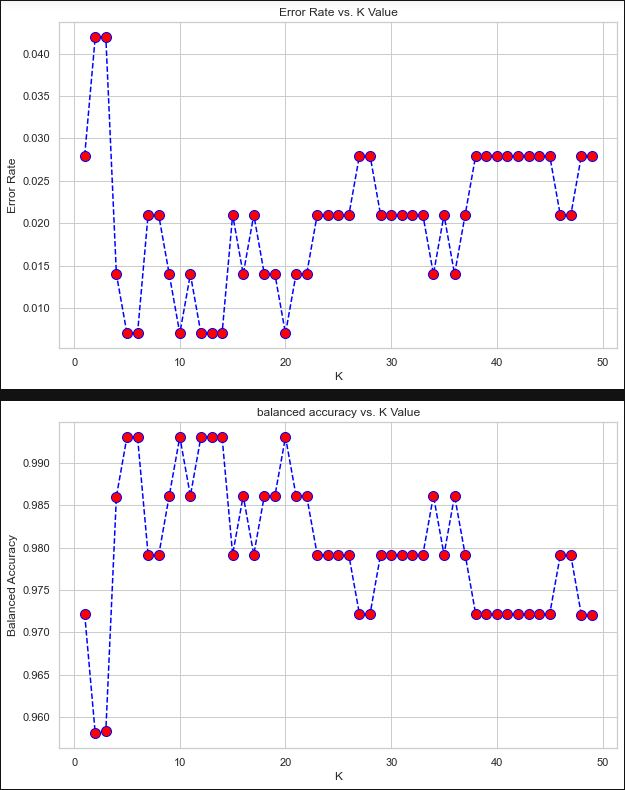
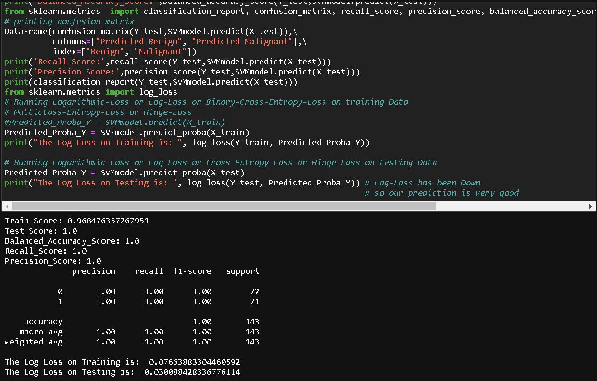
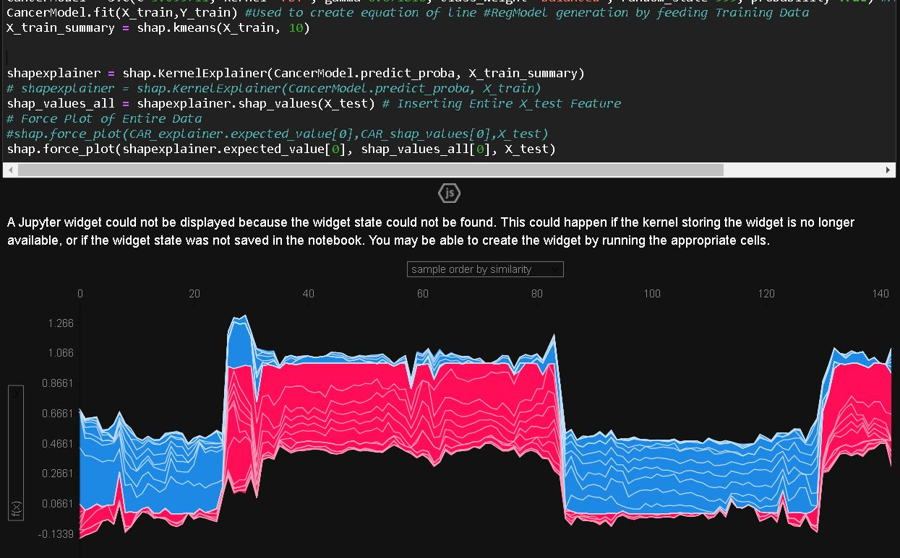
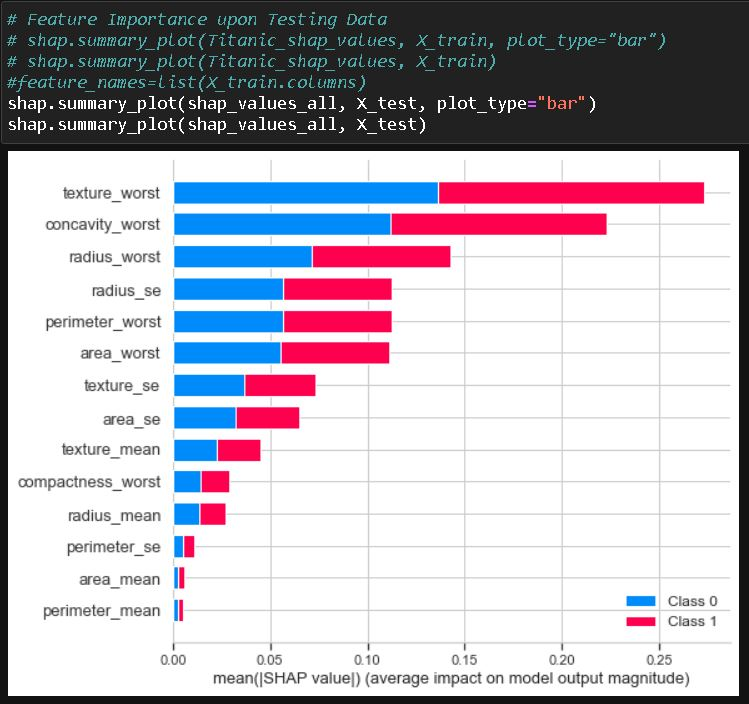
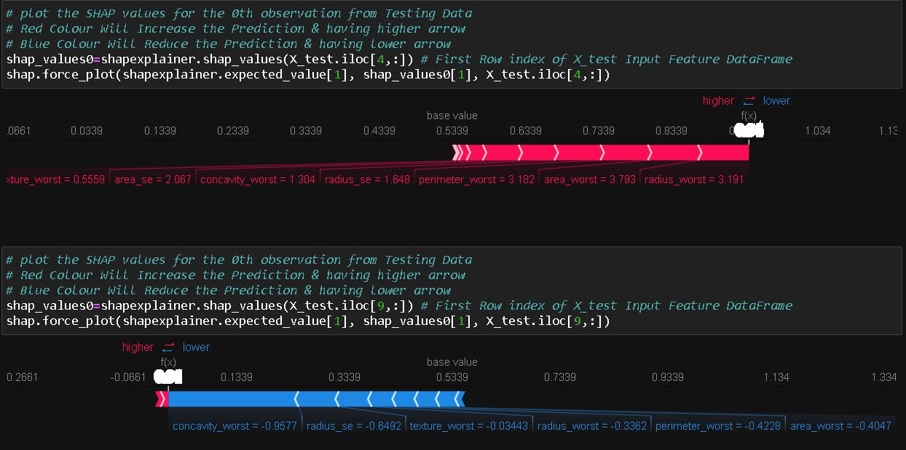
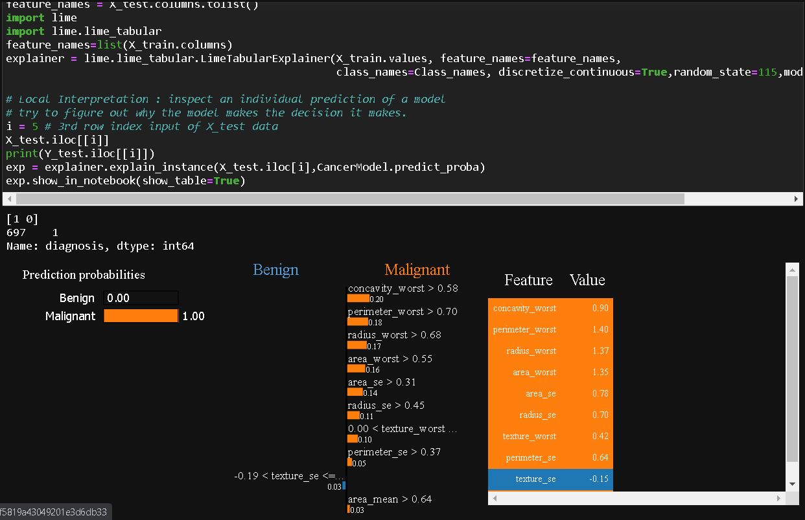
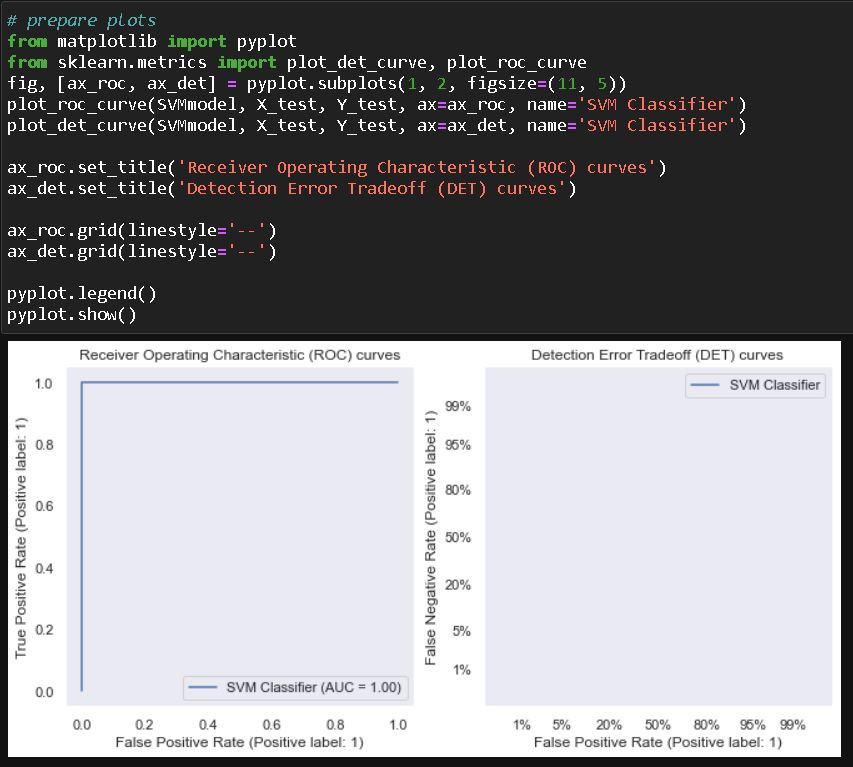
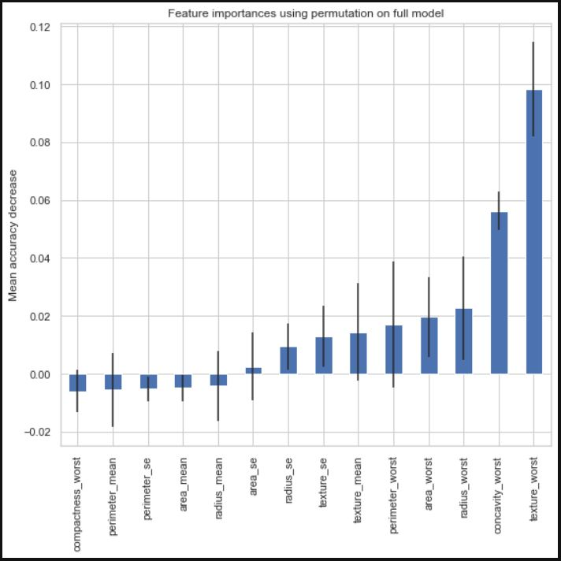

# Cancer-Cell-Prediction-with-LogisticReg-KNN-KMeans-SVM-DTree-RForest-AdaBoost-GradBoost
Python Data Science Project, Diabetes Detection using:

- KNN (99.30 % Accuracy)
- KMeans (90 % Accuracy)
- Support Vector Machine (100 % Accuracy)
- Decision Tree (99.30 % Accuracy)
- Random Forest (98.60 % Accuracy)
- AdaBoostClassifier (100 % Accuracy)
- GradientBoostingClassifier (99.30 % Accuracy)

For other Accuracy Details Please Check the Project. Other Accuracy Criterias are AUC & ROC Curve, Confusion Matrix, Classification Report, recall_score, precision_score etc.

## Problem Statement
Machine learning is widely used in bio informatics and particularly in breast cancer diagnosis. In this project, I have used 7 types of ML classification Algorithm methods to detect breast cancer. Cancer diagnosis is one of the most studied problems in the medical domain. Several researchers have focused in order to improve performance and achieved to obtain satisfactory results. Early detection of cancer is essential for a rapid response and better chances of cure. Unfortunately, early detection of cancer is often difficult because the symptoms of the disease at the beginning are absent. Thus, it is necessary to discover and interpret new knowledge to prevent and minimize the risk adverse consequences.

To understand this problem more precisely, tools are needed to help oncologists to choose the treatment required for healing or prevention of recurrence by reducing the harmful effects of certain treatments and their costs. In artificial intelligent, machine learning is a discipline which allows the machine to evolve through a process. Wisconsin Diagnostic Breast Cancer (WDBC) dataset obtained by the university of Wisconsin Hospital is used to classify tumors as benign or malignant.

In this Project I have unleashed the useful Data Science insights using this Cancer dataset and performed the feature selection, feature engineering & missing data handling precisely to build Classification models. In this project I have used 7 types of Classification Algorithms which are KNN, KMeans, Support Vector Machine, Decision Tree, Random Forest, Ada-Boost-Classifier, Gradient-Boosting-Classifier. 7 Algorithms along with combining the power of best statistical rules & principles to maximise accuracy at its best followed by all statistical conditions. The best thing is my model is not having any Multicollinearity Problem. All features are fulfilling Statistically Significant concept respect to the target variable. I also have balanced the Target Variable ie Outcome by using Over Sampling Technique.
